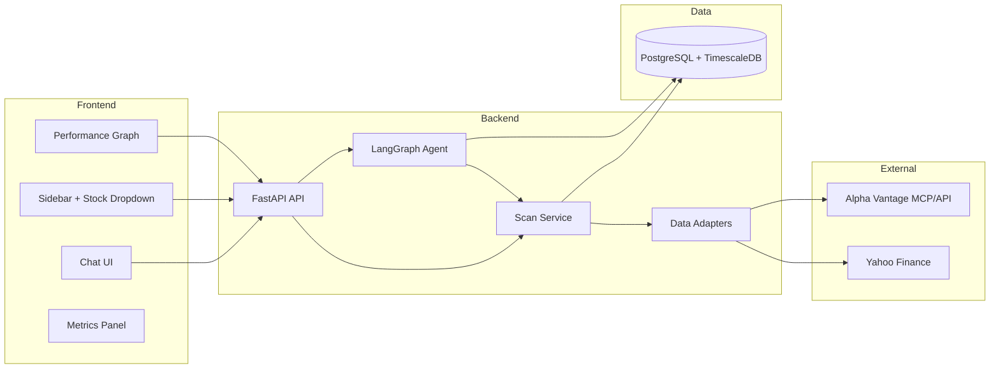

# Financial Assistant: Research, Architecture, and Scan Strategy

## Step 1: Research Summary

### Data sources (from [research.md](research.md))

| Source | Use case | Notes |

|--------|----------|--------|

| **Alpha Vantage** | OHLCV, fundamentals, news, metrics | MCP available in project; free tier **25 req/day, 5/min**. Rich: TIME_SERIES_* (daily/weekly/monthly), COMPANY_OVERVIEW, NEWS_SENTIMENT, INCOME_STATEMENT, BALANCE_SHEET, EARNINGS, RSI, MACD, etc. |

| **Yahoo Finance (yfinance)** | Price, fundamentals, news, ISIN lookup | Free, no key. Good for ISIN→ticker via search API; `msft.info`, `hist`, `news`, etc. |

| **Investing.com** | OHLCV, commodities, economic calendar | investpy broken (Cloudflare); use **investiny** as interim. |

| **Stooq** | OHLCV (pandas-datareader) | More history than Investing.com. |

| **SimFin** | Fundamentals (12-month delayed) | Registration; bulk/API. |

| **Edgar SEC** | Filings (10-K, 8-K) | py-edgar; raw but authoritative. |

| **FRED** | Macro (GDP, CPI, rates) | fredapi; API key. |

| **Binance** | Crypto only | Not needed for equity list. |

**Recommendation:** Primary: **Alpha Vantage (MCP or direct API)** + **Yahoo Finance** (ISIN resolution, fallback data). Add others later via adapters.

### ISIN → Ticker

- [stocks_list.csv](stocks_list.csv) has **ISIN** and **Name** (~13.6k rows). Alpha Vantage uses **symbol** (e.g. IBM).
- **Options:** (1) Yahoo Finance search by ISIN → ticker, cache in DB; (2) Alpha Vantage SYMBOL_SEARCH by company name. Prefer (1) for accuracy; cache mapping in `symbol_resolution` table.

### Backend stack

- **GROQ + qwen3-32b:** LangChain `ChatGroq` ([docs](https://python.langchain.com/docs/integrations/chat/groq/)); env `GROQ_API_KEY`.
- **LangGraph:** Orchestrator + subagents (research, metrics, web search); tool-calling for MCP/API. MCP: use **langchain-mcp-adapters** or LangGraph MCP client to call Alpha Vantage MCP (remote URL); or call Alpha Vantage REST directly behind a unified adapter to avoid MCP complexity in serverless/Docker.
- **Unified data access:** Adapter pattern: one interface, multiple implementations (Alpha Vantage, Yahoo, etc.) so new sources are plug-in.

### Database

- **PostgreSQL** for: users/sessions, chat history, scan cache (metadata + payloads), symbol resolution (ISIN↔ticker).
- **Time-series:** Option A) **TimescaleDB extension** in same PostgreSQL for OHLCV (compression, fast range queries). Option B) Store OHLCV in PostgreSQL (JSONB or normalized table) with TTL-based refresh. Recommendation: **PostgreSQL + TimescaleDB extension** (single DB, Docker-friendly) for OHLCV; rest in normal tables.

### Caching and rate limits

- Alpha Vantage free: 25/day, 5/min → **aggressive caching** and batch-once-per-symbol.
- **TTL by type:** Quote / realtime: 15 min. Daily/weekly/monthly series: 24 h. Fundamentals (overview, income, balance): 24 h. News: 1 h. Resolved ISIN→ticker: long-lived (e.g. 30 days) or permanent.
- Cache key: `(symbol, data_type, interval)` (e.g. `IBM`, `TIME_SERIES_DAILY`, `1d`). On first request for a stock: run full scan, store all; subsequent requests serve from DB until TTL.

### Frontend

- **Chat + sidebar:** ChatGPT-like; sidebar with dropdown of stocks from `stocks_list.csv` (loaded once, or from backend).
- **Per stock:** Graph (performance) with timescale selector (1D, 5D, 1M, 3M, 1Y, etc.); metrics panel (from COMPANY_OVERVIEW + technicals).
- **Assistant:** Answers using context from cache + optional web search (e.g. latest news).
- **Tech:** React or Next.js, dark theme (Tailwind), smooth transitions; streaming for chat (SSE or WebSocket).

### Docker

- **Compose:** `backend` (FastAPI + uvicorn), `frontend` (Node build + Nginx or dev server), `postgres` (PostgreSQL + TimescaleDB extension). Optional: `nginx` reverse proxy for `/api` → backend.
- Single `.env` for `GROQ_API_KEY`, `DATABASE_URL`, `ALPHA_VANTAGE_API_KEY` (if using direct API beside MCP).

---

## Step 2: Architecture Proposal

### High-level layout

### Backend structure (extendable)

- **API layer:** REST (e.g. `/api/chat`, `/api/stocks`, `/api/stocks/{id}/series`, `/api/stocks/{id}/metrics`, `/api/stocks/{id}/scan`). Auth later if needed.
- **Agent:** LangGraph graph: **orchestrator** node; subagents/tools: “get_stock_data” (calls Scan), “search_web” (optional), “get_metrics”, “get_news”. Tools read from **cache first** (Scan service); Scan fills cache from adapters when missing or stale.
- **Unified interface:** e.g. `DataSourceAdapter` with `get_quote(symbol)`, `get_series(symbol, interval)`, `get_fundamentals(symbol)`, `get_news(symbol, limit)`. Implementations: `AlphaVantageAdapter`, `YahooFinanceAdapter`. New source = new adapter + config.
- **Scan service:** Input: symbol (or ISIN resolved to symbol). (1) Resolve ISIN→ticker if needed (DB or Yahoo). (2) For each required data type (quote, daily series, fundamentals, news), check cache (PostgreSQL/TimescaleDB). (3) If missing or TTL expired, call adapters (respecting 5/min for Alpha Vantage), then write to DB. (4) Return aggregated context for agent.

### Data model (conceptual)

- **symbol_resolution:** isin, symbol, name, source, updated_at.
- **scan_cache:** symbol, data_type, interval (nullable), payload (JSONB or ref to hypertable), fetched_at (for TTL).
- **ohlcv** (hypertable if TimescaleDB): time, symbol, open, high, low, close, volume.
- **chats / messages:** session_id, role, content, created_at (for chat history).

### Docker layout

- `docker-compose.yml`: services `backend`, `frontend`, `postgres`. Volumes for DB and optional frontend build.
- `backend/Dockerfile`: Python 3.11+, FastAPI, LangChain, LangGraph, psycopg2, etc.
- `frontend/Dockerfile`: Node build → static + Nginx, or dev server for dev.
- `.env.example`: GROQ_API_KEY, DATABASE_URL, ALPHA_VANTAGE_API_KEY.

### Extensibility

- New data source: add `XYAdapter(DataSourceAdapter)`, register in Scan service; no change to agent or API contract.
- New metric or series type: extend adapter interface and cache `data_type`/`interval`; frontend can request new endpoints or same endpoint with new params.

---

## Step 3: Deliverables (what goes into the repo)

### 1. [architecture.md](architecture.md) (to create)

- **Purpose:** Single place for architecture and deployment.
- **Sections:**
  - Overview and goals (chat assistant, stocks from CSV, graph + metrics + research).
  - Stack: Frontend (React/Next.js, dark UI), Backend (Python, FastAPI, LangChain, LangGraph, GROQ), DB (PostgreSQL + TimescaleDB).
  - Diagram: high-level (frontend ↔ backend ↔ DB ↔ external sources).
  - Backend layout: API, Agent (LangGraph), Scan service, Adapters; folder structure.
  - Data source adapter: abstract interface + list of current adapters (Alpha Vantage, Yahoo).
  - Data model: symbol_resolution, scan_cache, ohlcv hypertable, chats/messages.
  - Docker: compose services, env vars, optional Nginx.
  - Security and scaling notes: env secrets, rate limits, future auth.

### 2. [scan.md](scan.md) (to create)

- **Purpose:** How we scan and cache so the agent always has up-to-date context without exceeding API limits.
- **Sections:**
  - When scan runs: on “select stock” or first message about a symbol; optionally on explicit “Refresh”.
  - Data types and TTLs: table (e.g. quote 15m, daily 24h, fundamentals 24h, news 1h, ISIN resolution 30d).
  - Cache key design: (symbol, data_type, interval).
  - Flow: resolve ISIN → symbol; for each type, check cache → if miss/expired call adapter → store → return.
  - Alpha Vantage: rate limits (25/day, 5/min); batching strategy (one “full” scan per symbol per day; queue or delay requests).
  - Yahoo: ISIN search endpoint; fallback for quote/series if Alpha Vantage exhausted.
  - DB schema for cache: scan_cache table, optional TimescaleDB hypertable for OHLCV.
  - Stale-while-revalidate: optional (serve stale, refresh in background).

---

## Out of scope for this plan

- Implementation of frontend/backend code (only architecture and scan docs).
- User auth (can be added later; architecture allows it).
- Actual Alpha Vantage premium or other paid tiers (design works with free tier + cache).

---

## Next steps after approval

1. Create [architecture.md](architecture.md) with the content outlined above (including a mermaid diagram).
2. Create [scan.md](scan.md) with the scan strategy, TTL table, and batching/resolution details.
3. Optionally add a short “Research references” section in [research.md](research.md) or in architecture.md linking to Alpha Vantage, LangChain GROQ, LangGraph MCP, TimescaleDB, and investiny.